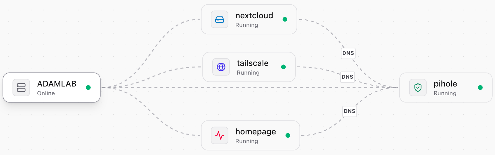
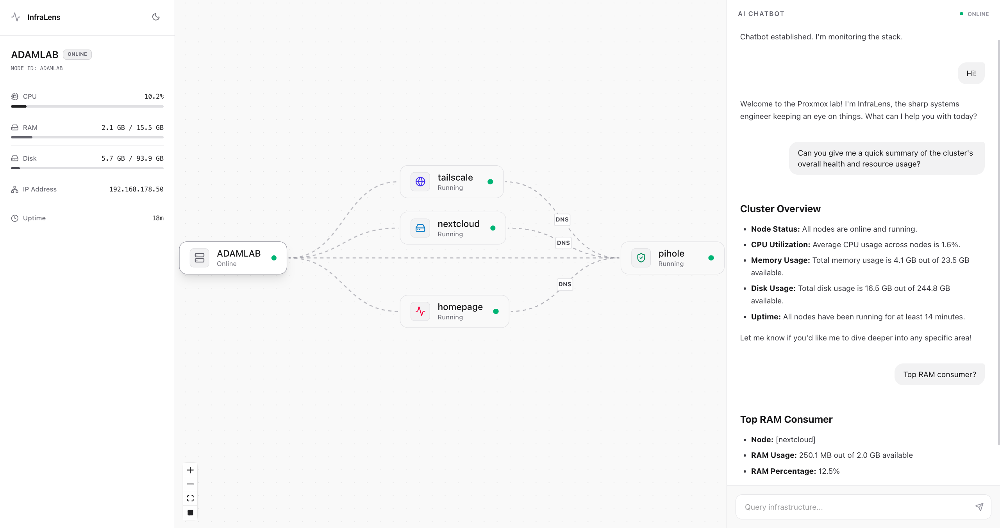
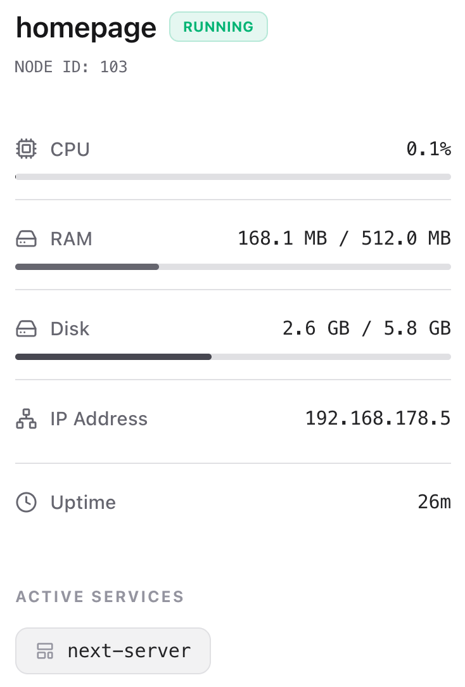

<div align="center">
  
  <h1>👁️ InfraLens</h1>
  
  <p>
    <strong>AI-Powered Monitoring, Topology Visualization, and Diagnostics for Proxmox Homelabs</strong>
  </p>

  <!-- Badges -->
  <p>
    
    
    
    
  </p>

  <p>
    <a href="#features">Features</a> •
    <a href="#installation-and-configuration">Installation</a> •
    <a href="#screenshots">Screenshots</a> •
    <a href="#license">License</a>
  </p>

</div>


<!-- HERO BANNER -->

*A dynamic, real-time visualization of your Proxmox infrastructure.*


##  Overview

InfraLens is a tool that turns your Proxmox server data into an interactive map. It uses a **Large Language Model (LLM)** to let you chat with your lab, making it easy to check system health and manage your nodes without reading through complex logs.

##  Technical Features

* 🕸️ **Automatic Network Mapping:** Automatically discovers Proxmox hosts, LXC containers, and Virtual Machines and renders them as a connected graph.
* 🧠 **LLM Chat:** A built-in chat interface that allows you to ask questions about your infrastructure in plain English (currently powered by local **Ollama** integration).
* ⚡ **Real-Time Stats:** Live tracking of CPU usage, RAM, Disk space, and Network speeds (RX/TX).
* 🔍 **Deep Service Scanning:** Uses SSH probing to look inside containers and identify active services like Docker, databases, or web servers.
* 🛡️ **Privacy-First:** Built for local networks. By using Ollama, your infrastructure data stays private and never leaves your home network.


## Screenshots

<details open>
<summary><b>The Neural Link (AI Diagnostics)</b></summary>
<br>
  

*Chat directly with your homelab to diagnose bottlenecks and query service status.*
</details>

<details open>
<summary><b>Real-Time Telemetry Modal</b></summary>
<br>


*Live tracking of resource consumption and active services for individual VMs and LXCs.*
</details>


##  Installation and Configuration

### Prerequisites
* **Node.js** (v18.0 or higher)
* **Python** (3.10 or higher)
* A **Proxmox VE Server** with an API Token
* **[Ollama](https://ollama.com/)** installed and running locally

### 1. Repository Initialization
```bash
git clone [https://github.com/AdamYahmadi/InfraLens.git](https://github.com/AdamYahmadi/InfraLens.git)
cd InfraLens
```

### 2. Backend Setup 
1. Navigate to the backend directory and set up your environment:
   ```bash
   cd backend
   python -m venv venv
   source venv/bin/activate  # On Windows: venv\Scripts\activate
   pip install -r requirements.txt
   ```
2. **Configure Environment:** Create a `.env` file based on `.env.example` and enter your Proxmox API and SSH credentials.
3. **Start the API:**
   
```bash
   python main.py
   ```

### 3. Frontend Setup 
1. Navigate to the frontend directory and install dependencies:
   ```bash
   cd frontend
   npm install
   ```
2. **Configure API Link:** Create a `.env` file and point it to your backend:
   ```ini
   VITE_API_URL="[http://127.0.0.1:8000](http://127.0.0.1:8000)"
   ```
3. **Launch:**
   
```bash
   npm run dev
   ```


## License
Distributed under the MIT License. 

<div align="center">
  <b>Developed by Adam Yahmadi.</b>
</div>