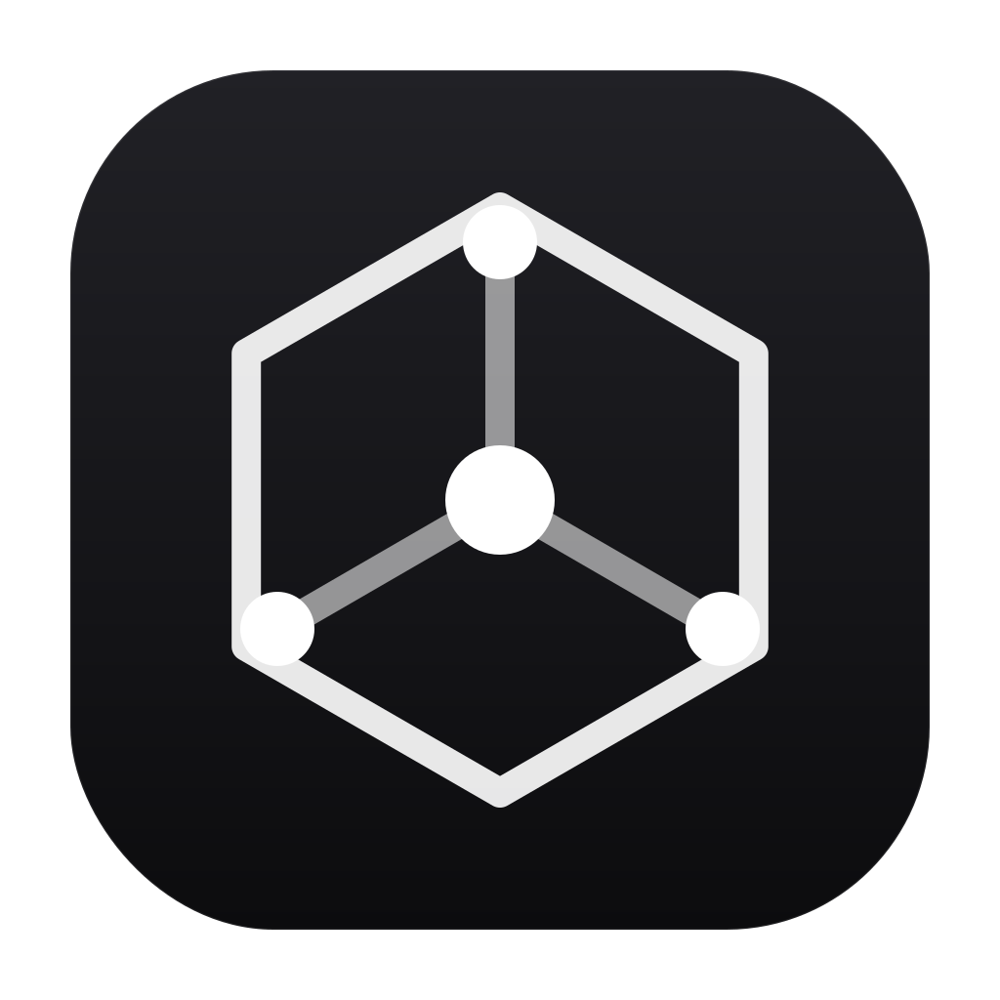
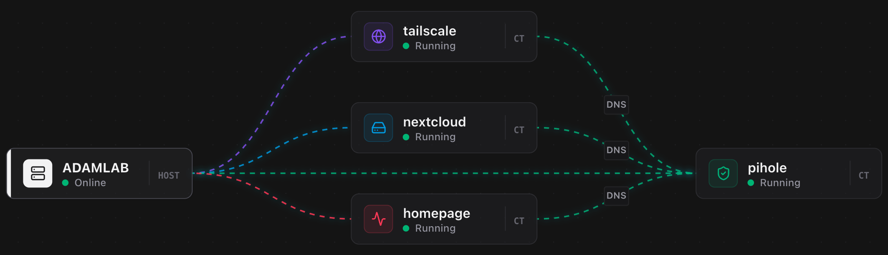
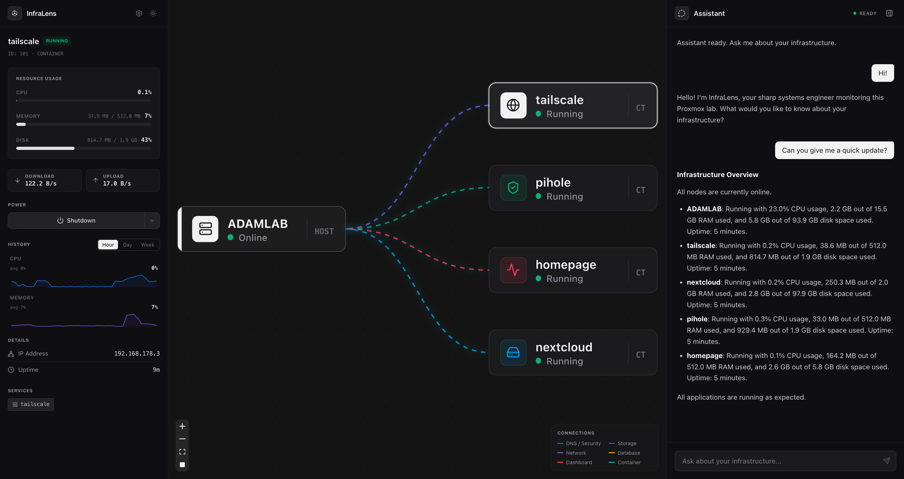

<div align="center">



# InfraLens

### See your Proxmox homelab. Ask it anything.

Real-time topology, live telemetry, and a local AI that actually knows your cluster — all on your own hardware.

<p>
  
  
  
  
  
</p>

<p>
  <a href="https://github.com/AdamYahmadi/InfraLens/releases"><b>⬇ Download</b></a> &nbsp;·&nbsp;
  <a href="#-features">Features</a> &nbsp;·&nbsp;
  <a href="#-install">Install</a> &nbsp;·&nbsp;
  <a href="#-screenshots">Screenshots</a> &nbsp;·&nbsp;
  <a href="#-development">Development</a>
</p>

<br/>



</div>

<br/>

---

## Overview

InfraLens connects to the Proxmox API, discovers every node, VM, and LXC container in your cluster, and draws them as a live topology graph with streaming telemetry. A local Ollama model receives structured, real-time cluster context — so you can ask about your infrastructure in plain language instead of digging through logs and dashboards.

> **Everything stays local.** Telemetry and chat run entirely on your network. No cluster data ever leaves your machine.

<br/>

## ✦ Features

| | |
|---|---|
| **Automatic discovery** | Enumerates hosts, VMs, and LXC containers through the Proxmox API and lays them out as an interactive graph. |
| **Live telemetry** | Per-node CPU, RAM, disk, uptime, and network throughput — updated in real time. |
| **Historical trends** | CPU and memory sparklines per node, with hour / day / week views from Proxmox RRD data. |
| **Power controls** | Start, stop, reboot, and shut down VMs and containers directly from the app. |
| **Cluster overview** | Totals, aggregate resource meters, an attention list for offline or high-load nodes, and a recent-activity feed. |
| **Service detection** | Probes containers over SSH to identify Docker, databases, web servers, and more. |
| **LLM diagnostics** | Streams live cluster state into a local Ollama model for conversational troubleshooting. |
| **Local only** | No third parties. No telemetry. Your credentials never leave your machine. |

<br/>

## ⬇ Install

InfraLens ships as a native desktop app for **macOS** and **Linux**, built with [Tauri 2](https://tauri.app). Grab the latest build from the [**Releases**](https://github.com/AdamYahmadi/InfraLens/releases) page.

| Platform | File |
|---|---|
| macOS · Apple Silicon | `InfraLens_x.x.x_aarch64.dmg` |
| macOS · Intel | `InfraLens_x.x.x_x64.dmg` |
| Linux · AppImage | `InfraLens_x.x.x_amd64.AppImage` |
| Linux · Debian / Ubuntu | `InfraLens_x.x.x_amd64.deb` |

<details open>
<summary><b>🍎 macOS — first launch</b></summary>

<br/>

The app is ad-hoc signed (not yet Apple-notarized), so macOS blocks it on first open. After dragging InfraLens into **Applications**, run this once:

```bash
xattr -cr /Applications/InfraLens.app
```

That clears the quarantine flag macOS adds to downloaded apps. Open InfraLens normally, then enable it under **System Settings → Privacy & Security → Local Network** so it can reach your Proxmox host.

You only do this once per install — after that, InfraLens opens straight to your topology.

</details>

<details>
<summary><b>🐧 Linux</b></summary>

<br/>

**AppImage** — make it executable and run:

```bash
chmod +x InfraLens_x.x.x_amd64.AppImage
./InfraLens_x.x.x_amd64.AppImage
```

**Debian / Ubuntu** — install the `.deb`:

```bash
sudo dpkg -i InfraLens_x.x.x_amd64.deb
```

</details>

<details>
<summary><b>🧹 Uninstall &amp; wipe data</b></summary>

<br/>

```bash
sudo rm -rf /Applications/InfraLens.app
rm -rf ~/Library/Application\ Support/InfraLens
tccutil reset LocalNetwork
```

</details>

<br/>

### First-run setup

A short wizard walks you through three steps:

1. **Proxmox** — host / IP, API token user, token name, and value
2. **SSH probe** *(optional)* — credentials to detect services inside LXC containers
3. **Local AI** — pick an installed Ollama model for diagnostics

Credentials are saved locally to `~/Library/Application Support/InfraLens/config.json` (macOS) or `~/.config/InfraLens/config.json` (Linux) — and never leave your machine.

<br/>

## 🖼 Screenshots

**LLM diagnostics** — query service status and trace bottlenecks in plain language with a local model.



<br/>


## 🛠 Development

Run from source or contribute.

**Prerequisites** — Node.js 18+, Python 3.10+, Rust ([rustup](https://rustup.rs)), a Proxmox VE server with an API token, and [Ollama](https://ollama.com/) running locally.

```bash
# 1. Clone
git clone https://github.com/AdamYahmadi/InfraLens.git
cd InfraLens

# 2. Backend  ->  http://127.0.0.1:8756
cd backend
python -m venv venv
source venv/bin/activate            # Windows: venv\Scripts\activate
pip install -r requirements.txt
python main.py

# 3. Frontend (new terminal)  ->  http://localhost:5173
cd frontend
npm install
npm run dev
```

The dev server proxies `/api` to the backend automatically — no `.env` needed.

<br/>

## 🧱 Architecture

```
InfraLens/
├── backend/      FastAPI · Proxmox discovery, SSH probe, Ollama chat
├── frontend/     React + Vite · topology UI, telemetry panels, chat
└── src-tauri/    Tauri 2 · bundles the backend, manages the window
```

<br/>

---

<div align="center">

Built for homelabbers. Released under the [MIT License](./LICENSE).

</div>